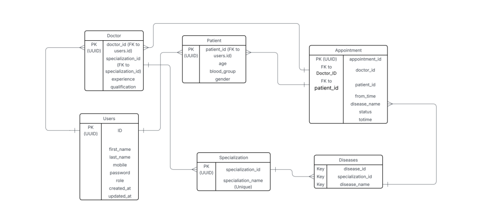
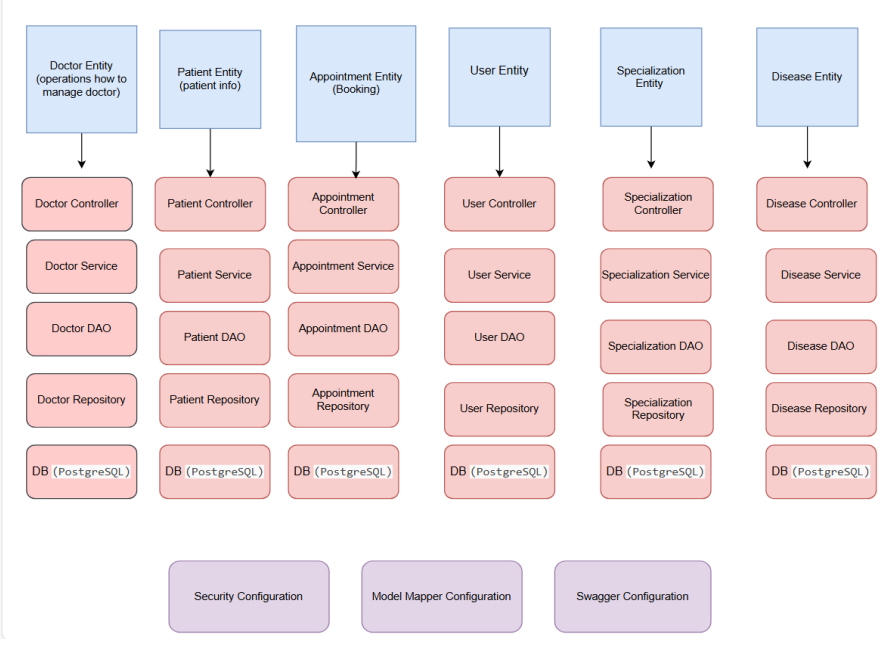

# DoctorPatientService

**UseCase**: To Create a Doctor Patient REST Service and to manage all the basic CRUD operations.
_________________________________________________________________________________________________________________________________________________________
**Tech Stacks Used:** Framework: Spring Boot Build Tool: Maven Database: PostgreSQL API Documentation: Swagger UI (OpenAPI) Testing & Quality: JUnit, Mockito, JaCoCo, SonarQube Logging: SLF4J with Logback
_________________________________________________________________________________________________________________________________________________________

**Expected Output is:** Should be able to run the service with the source code or via the jar. Should be able to make GET, POST, PUT and DELETE requests. Should be able to check the data in the database. Custom exceptions should be thrown if it makes sense. Input validation should be done wherever it makes sense. Should return ResponeEntity with appropriate status codes.
_________________________________________________________________________________________________________________________________________________________

Entites which provided in usecase was Doctor and Patient, But we create some more entites to acheive the service

Doctor - doctor_id, specialization_id, experience, qualification
Patient - patient_id, age, blodd_group, gender
Appointment - appointment_id, doctor_id, patient_id, from_time, disease_name, status, to_time
Users - id, first_name, last_name, mobile, password, role, created_at, updated_at
Specialization - specialization_id, specialization_name
Diseases - disease_id, specialization_id, disease_name

**Usecase Requirement:**
* A doctor can have maximum 4 patients and minimum zero patients.
* Adding a 5th patient throws a custom exception.
* A patient can:
* A patient can be created and can exists without attached to
  any doctor.
* A patient can be later attached to any doctor.
* A patient can be attached to only one doctor.
* A patient can be removed from one doctor and can be attached
  to another doctor (if the other doctor have less then 4 patients
_________________________________________________________________________________________________________________________________________________________
**API Documentation:**
_________________________________________________________________________________________________________________________________________________________

**Swagger UI available at:** http://localhost:8080/swagger-ui.html
_________________________________________________________________________________________________________________________________________________________

**Each endpoint we have documented with:**  Request/Response models  HTTP methods  Status codes
_________________________________________________________________________________________________________________________________________________________

**Testing & Quality:**
_________________________________________________________________________________________________________________________________________________________

**Unit Testing:** JUnit & Mockito Code Coverage: JaCoCo Code Quality: SonarQube Logging: SLF4J (Simple Logging Facade for Java) for traceability and debugging
 _________________________________________________________________________________________________________________________________________________________

**DB Design:**

_________________________________________________________________________________________________________________________________________________________

**Associations Mapped:**
USERS ↔ Doctors One to One
USERS ↔ Patients One to One
Appointments ↔ Doctors One to Many
Appointments ↔ Patients One to One
Patients ↔ Diseases Many to One
Disease ↔ Specialization Many to One
Specialization ↔ Doctors One to Many
_________________________________________________________________________________________________________________________________________________________

 **Code Flow Diagram**

_________________________________________________________________________________________________________________________________________________________

**Exception handling are:**
* CustomException
* DiseaseNotFoundException
* DoctorNotAvailableException
* DoctorPatientLimitExceededException
* DuplicateAppointmentException
* EntityNotFoundException
* ErrorResponse
* GlobalExceptionHandler
* InvalidOperationException
* PatientExceptionHandler
* ResourceNotFoundException
API Documentation
_________________________________________________________________________________________________________________________________________________________

**Swagger UI available at:** http://localhost:8080/swagger-ui.html
Each endpoint is documented with:
* Request/Response models
* HTTP methods
* Status codes
* Example payloads
_________________________________________________________________________________________________________________________________________________________

**Testing & Quality**
Unit Testing: JUnit & Mockito
Code Coverage: JaCoCo
Code Quality: SonarQube
Logging: SLF4J (Simple Logging Facade for Java) for traceability
and debuggin

_______________________________________________________________________________________
**DEVELOPERS**
* Vaddi Vijaya lakshmi
* Ujwal G
* Tamizhkavi K
* Tharun S
* Sri sruthi Kolluri
* Shruti Srivasthava
* Subitsha Ramalingam

